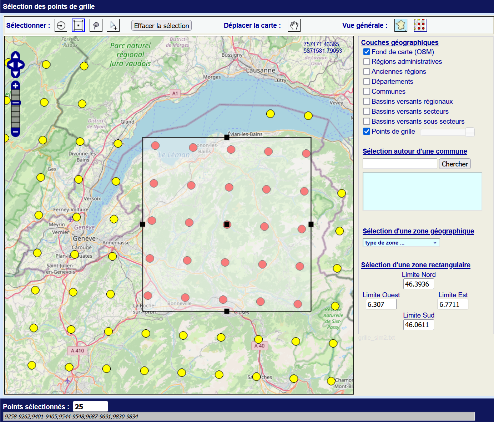
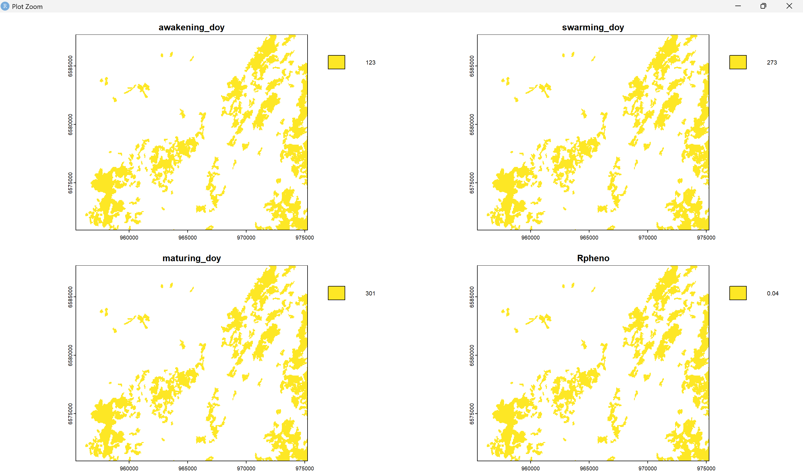

<p align="center">
  
</p>

# B2SPM: Bark-Beetle Spatialized Phenological Model


## Table of Contents

- [Introduction](#introduction)
- [Installation](#installation)
- [Dependencies](#dependencies)
  - [Internal Functionality](#internal-functionality)
  - [External Data](#external-data)
- [Main Functions](#main-functions)
  - [Radiative Model](#radiative-model-for-sub-phloem-temperature)
- [Usage Example](#usage-example)
- [References](#references)
- [Citation](#citation)

## Introduction

The **B2SPM** package models the development and spread of the bark beetle in spruce forests of the French Alpine arc by integrating topoclimatological data and a spatialized phenological model.

It enables the analysis of bark beetle epidemiology for the current period (current year, for monitoring) or the future (to anticipate attack risks and adapt forest management strategies).

The model is based on a minimum computational and interpretation grid. The computational grid is constrained by the systematic spacing of DRIAS points (8 km), which are pseudo-randomly distributed across France. The interpretation grid is set at 250 m to account for the spatialization accuracy limits of the indicators and the intra-valley/forest massif variability, which is difficult to model at a finer scale. Therefore, a probable attack should only be assessed at this spatial scale.

<p align="center">
  <br>
  <em style="font-size: 8pt;">Map of Spruce Forests in the French Alpine Arc. BDFORÊTV2, IGN 2025</em>
</p>

## Installation

B2SPM is compatible with Windows, Mac, and Linux.
You can install B2SPM from GitHub using:

```r
# install.packages("devtools")
devtools::install_github("colinfabre/b2spm")
```

## Dependencies

### Internal Functionality

B2SPM relies on several other packages to function; make sure to download them beforehand to ensure proper operation:

```r
install.packages("utils", "stats", "terra", "sf", "gstat")
```

There are no specific package versions required.

### External Data

B2SPM requires a DEM (Digital Elevation Model) covering at least the entire study area where the modeling will be conducted. The resolution of this DEM should not exceed 25m (the final analysis grid is 250m, and a resolution that is too fine (e.g., 5m) significantly increases computation times without improving model accuracy).

The phenological model relies on climate data from the [DRIAS portal](https://www.drias-climat.fr), which provides regionalized climate projections for mainland France. The corrected DRIAS-2020 data are available for several different models, but the most accurate for France is MétéoFrance's global ARPEGE-Climat model, forced by the regional climate model (RCM) and used in the ALADIN63 simulation. The preferred scenario is RCP8.5, as it aligns with the current greenhouse gas emission curve.

<p align="center">
  
</p>

The user can select the desired study year and extract all DRIAS points contained within their study area, adding a one-row and one-column margin on all sides to ensure proper spatialization of phenological indicators.

<p align="center">
  
  
</p>

The climate parameters required to run B2SPM are:

- Daily minimum temperature (°C)
- Daily maximum temperature (°C)
- Daily average temperature (°C)
- Total daily precipitation (mm)
- Specific humidity (kg/kg)
- Incident visible solar radiation (W/m²)
- Incident infrared solar radiation (W/m²)
- Wind speed (m/s)

<p align="center">
  
</p>

Data downloaded from DRIAS-2020 must be provided as `.txt` files (native format) following this structure:

- Columns:
  - POSITION: DRIAS point identifier
  - DATE: measurement date (format DD/MM/YYYY)
  - Climate parameters (one column per selected parameter)

- POSITION Format:
  - Point identifier
  - Lambert93 coordinates (LambertX, LambertY)

- Separator: fields must be comma-separated (,)

Example of an expected DRIAS file structure:

```r
point_id, lambertx, lamberty,date,tmin,tmax,tmoy,prec,spec_hum,vis_solrad,ir_solrad,wind
ID001,908000,2129000,01/01/2030,-2.3,5.7,1.5,0.0,0.0025,150.0,220.0,2.1
ID001,908000,2129000,02/01/2030,-1.8,6.2,2.1,0.1,0.0024,152.5,225.0,1.8
```

<p align="center">
  
</p>

## Main Functions

`topo_comp(dem)`: Extracts spruce forest areas and topographic data from the study area.

`kpi(awakening_data, swarming_data, maturing_data)`: Spatializes phenological indicators.

`rpc(phenological_indicators)`: Calculates the global epidemic risk indicator Rpheno.

**`pipeline(drias_txt_path, dem)`: Runs the complete B2SPM pipeline on the study area using the provided DRIAS data.**

### Radiative Model for Sub-Phloem Temperature

The bark beetle hibernates and then digs its egg-laying galleries where larvae mature under the bark of spruce trees. Calculating sub-phloem temperatures is therefore crucial to understanding and accurately modeling the insect's phenological cycle. This temperature is influenced by several factors related to forest structure and environmental conditions:

- Solar radiation (visible and infrared): the bark absorbs part of the radiation, locally increasing the temperature. However, in a dense spruce forest, shading reduces this effect.

- Wind: stronger winds promote heat dissipation from the trunk, reducing heating.

- Specific humidity and precipitation: high humidity and regular precipitation increase the thermal inertia of the bark, maintaining a more stable temperature (buffer effect).

- Diurnal thermal gradient: the thermal inertia of the phloem reduces daily temperature amplitude, with limited elevation of tmaxphloem and moderate cooling of tminphloem.

A constrained non-linear radiative model accounting for the impact of these environmental variables has been directly integrated into B2SPM to model the evolution of sub-phloem temperature, which dictates bark beetle phenology. It is structured as follows:

#### Heat Conduction Equation for Spruce Bark and Phloem

$$\frac{\partial t}{\partial T_{phloem}} = \alpha \left( \frac{\partial^2 T_{phloem}}{\partial x^2} \right) + S(x,t)$$

where:
- $$T_{\text{phloem}}(x,t)$$ temperature at depth $$x$$ in the bark/phloem at time $$t$$
- $$\alpha \approx 1.2 \times 10^{-7}{m^2/s}$$ thermal diffusivity of wood $$\frac{k}{\rho C_p}$$, as a function of conductivity $$k \approx 0.15{W/m\cdot K}$$, density $$\rho \approx 600{kg/m^3}$$ (for decaying wood) and heat capacity $$C_p \approx 1600{J/kg \cdot K}$$
- $$S(x,t)$$ source term representing solar radiation absorption in the phloem

Assuming a steady-state equilibrium $$(\frac{\partial T}{\partial t} = 0)$$, and an exponential attenuation of absorbed heat in the bark, we obtain:

$$T_{phloem} = T_{ext} + \beta_{vis.solrad} \times e^{-\lambda x} \times vis.solrad + \beta_{ir.solrad} \times e^{-\lambda x} \times {ir.solrad}$$

where:
- $$\lambda \approx 0.2{mm^{-1}}$$ radiation attenuation coefficient in the bark (related to bark thickness and cellular structure)

#### 2. Modeling Cooling by Convection and Evapotranspiration

Newton's Law of Cooling: $$\frac{dT_{phloem}}{dt} = -h \times (T_{phloem} - T_{ext})$$

where:
- $$h$$ convection coefficient (dependent on wind and humidity)

At steady-state:

$$T_{phloem} = T_{ext} + \frac{S}{h}$$

where:
- $$S$$ absorbed heat

But we know that $$h$$ depends on wind and humidity:

$$h = h_{0} \times \left(1 + \gamma_{wind} \times e^{\delta \times {wind}} \right) \times \left(1 + \gamma_{spec.hum} \times {spec.hum}^b \right)$$

where:
- $$h_0 \approx 10\text{W/m}^2 \cdot \text{K}$$ base convection coefficient
- $$\gamma_{wind} \approx 0.1$$ wind adjustment coefficient
- $$\gamma_{spec.hum} \approx 0.3$$ humidity adjustment coefficient
- $$b \approx 1.3$$ humidity adjustment exponent

#### 3. Final Radiative Model

Combining (1) and (2), we obtain:

$$T_{phloem} = T_{ext} + \frac{\beta_{vis.solrad} \times e^{-\lambda x} \times {vis.solrad} + \beta_{ir.solrad} \times e^{-\lambda x} \times {ir.solrad}}{h_0 \times \left(1 + \gamma_{wind} \times e^{\delta \times {wind}}\right) \times \left(1 + \gamma_{spec.hum} \times {spec.hum}^b\right)}$$

with the physical constraint:

$$0 \leq T_{phloem} - T_{ext} \leq 2.5^\circ C$$


## Usage Example

```r
library(b2spm)
dem_chablais <- rast("mnt_chablais.tif")

# Run the model for the Chablais in 2030
results_chablais <- pipeline("drias_chablais_2030", dem_chablais)

# Display the epidemic risk map
plot(results_chablais$rpheno, main = "Epidemic Risk Map")
```

<p align="center">
  
</p>


## References

FABRE, C. *ModEpiSco: Modélisation des Épidémies de Scolytes et de l'impact sur les forêts alpines françaises du Nord dans le contexte du changement climatique*, IUGA, 2023. [CrossRef](http://doi.org/10.13140/RG.2.2.14613.91362/2)

AMMAN, G. D. *Population changes of the mountain pine beetle in relation to elevation*, Environmental Entomology, 1973. [CrossRef](https://doi.org/10.1093/ee/2.4.541)

BENTZ, B. J., MULLINS, D. E. *Ecology of mountain pine beetle cold hardening in the field: Interactions between cold and subcortical beetle behavior*, Environmental Entomology, 1999. [CrossRef](https://doi.org/10.1093/ee/28.4.577)

HANSEN, E. M., BENTZ, B. J. *Comparison of reproductive capacity among univoltine, semivoltine, and re-emerged parent mountain pine beetle (Coleoptera: Scolytidae) populations*, The Canadian Entomologist, 2003. [CrossRef](https://doi.org/10.4039/n02-109)

NETHERER, S. *Modelling of bark beetle development and of site- and stand-related predisposition to Ips typographus*, 2003. [CrossRef](https://www.researchgate.net/publication/233755203_Modelling_of_bark_beetle_development_and_of_site-_and_stand-related_predisposition_to_Ips_typographus_L_Coleoptera_Scolytidae_A_contribution_to_Risk_Assessment)

WERMELINGER, B. *Ecology and management of the spruce bark beetle Ips typographus, a review of recent research*, ForEco, 2004. [CrossRef](https://doi.org/10.1016/j.foreco.2004.07.018)

POWELL, J. A., LOGAN, J. A. *Insect seasonality: Circle map analysis of temperature-driven life cycles*, Theoretical Population Biology, 2005. [CrossRef](10.1016/j.tpb.2004.10.001)

SAFRANYIK, L., CARROLL, A. L. *The biology and epidemiology of the mountain pine beetle in lodgepole pine forests*, Canadian Forest Service, 2006. [CrossRef](https://ostrnrcan-dostrncan.canada.ca/handle/1845/222421)

TRÂN, J. et al. *Impact of minimum winter temperatures on the population dynamics of Dendroctonus frontalis*, ESA, 2007. [CrossRef](https://doi.org/10.1890/06-0512)

FACCOLI, M. *Composition and elevation of spruce forests affect susceptibility to bark beetle attacks, implications for forest management*, Forests, 2014. [CrossRef](https://doi.org/10.3390/f5010088)

JAKOBY, O. et al. *Climate change alters elevational phenology patterns of the European spruce bark*, Global Change Biology, 2019. [CrossRef](https://doi.org/10.1111/gcb.14766)


## Citation

> FABRE, C. *B2SPM: Bark-Beetle Spatialized Phenological Model*, R package, 2025. [CrossRef](https://b2spm.colinfabre.fr)